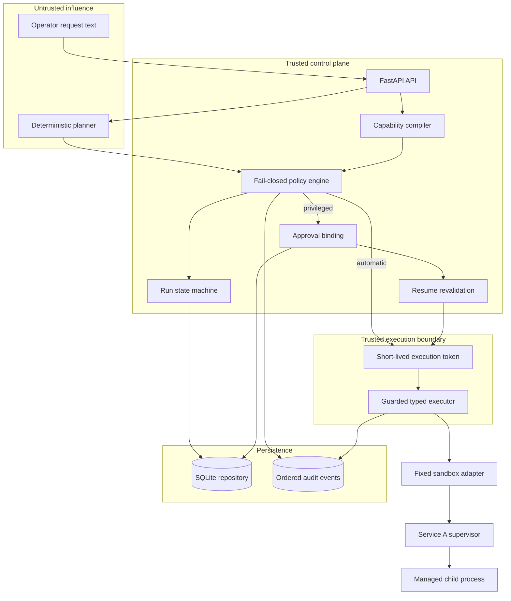
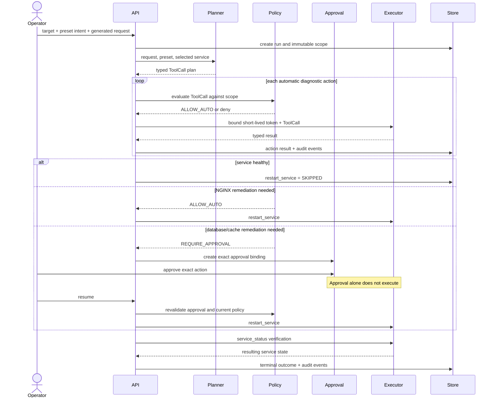
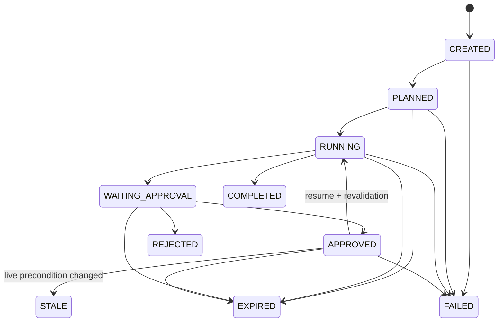

# Guarded Agent Runner Architecture

## GAR-PCS-001 migration boundary

The M2 read-only implementation adds a stateless, authenticated official-SDK MCP
boundary without adding mutation authority. Every request
maps a bearer digest to a stored immutable session scope before reaching the
fixed ten-tool server; approval remains exclusively owner-local.

GARGuard now provides the runtime half of the read-only adapter through a
bounded, atomically published snapshot. The Go reader verifies the fixed
pairing, schema, timestamp, bounds, duplicate fields, and symlink-free path.
The separately privileged `gar-host` process observes one owner-enrolled full
container ID through a fixed Docker Unix socket and fixed data root. It emits a
bounded atomic host snapshot outside that data root. The MCP frontend receives
only the host and Paper snapshots, never the Docker socket. A composite reader
requires matching identities, fresh paired Paper readiness, bounded observation
skew, and attributed plugin hashes before it can produce proposal evidence.
Backup and mutation facts remain unavailable.

The admission profile adds two cooperating fail-closed controls without adding
mutation authority. `gar-gate` owns the host's IPv4/IPv6 loopback port 25565 in
Paper's network namespace and proxies only to Paper's unexposed port 25566.
Its owner-local open lease is capped at 30 seconds and is effective only after
GARGuard publishes a fresh matching `OPEN_READ_ONLY_ALPHA` acknowledgment.
GARGuard independently rejects pre-login while the lease is closed or invalid.
The host observer verifies the gate container and image, shared network
namespace, exact bindings, read-only rootfs, dropped capabilities, restart
policy, `no-new-privileges`, lack of Docker socket access, the enrolled gate
binary digest, fixed command, and read-only evidence mounts. Closing the lease drops existing
proxied connections; process or container restart never recreates an open
lease.

The authoritative product direction is now Guarded Plugin Change & Recovery for Paper. The Go M1 core under `internal/` implements immutable authority, frozen intents, owner-local approval, durable writer ownership, UNKNOWN blocking, and shadow revalidation against a fake target. `compatibility.lock` records one exact `LOCAL_PAPER_READ_ONLY` tuple while G-02 and G-04 fail closed; it does not authorize live mutation.

The Python/FastAPI architecture documented below predates GAR-PCS-001. It remains a legacy service-sandbox demonstration and regression fixture; its web approval, generic service names, and restart action are not the Paper v0.1 agent or operator contract. The two evidence sets must not be combined.

```text
GAR v0.1 M1 + M2 read-only components

Agent -> loopback MCP + Origin + bearer -> stored immutable session scope
                                                   |
                                      fixed ten-tool contract
                                                   |
Agent proposal ---------------------------> frozen ChangeIntent -> SQLite journal
                                                                  |
Owner garctl -> exact ID + digest approval -----------------------+
                                                                  |
                                                       operation ownership
                                                                  |
                                                SHADOW_ONLY; live mutation blocked

Owner gar-gate open/close -> bounded lease -> GARGuard acknowledgment
                                            -> gate:25565 -> Paper:25566
gar-host -> validates Paper + gate topology -> bounded host snapshot
```

See [GAR v0.1 implementation status](docs/GAR_V01_IMPLEMENTATION.md) for the invariant and acceptance mapping.

## Legacy service-sandbox architecture

Guarded Agent Runner separates proposal generation from authorization and execution. The design assumes request text and planner output may be malicious. It gives those components influence over a typed proposal, but never gives them credentials, approval objects, execution tokens, or a general-purpose execution interface.

## System goals

The MVP answers four engineering questions:

1. Can an untrusted planner propose useful infrastructure work without receiving authority?
2. Can every action be constrained to one service and a small typed action set?
3. Can privileged approval be exact, time-bound, and revalidated immediately before execution?
4. Can the system prove both what it decided and whether remediation achieved the desired result?

It intentionally does not answer infrastructure integration, identity-provider, distributed-locking, or immutable-ledger questions. Those production gaps are explicit rather than simulated.

## Topology and trust boundaries



### Untrusted boundary

The request and planner may select only values accepted by the API and planner preset. The planner never receives credentials or authorization objects. Tests can inject arbitrary planner output to prove that unknown actions, malformed arguments, and out-of-scope resources fail before execution.

### Trusted control plane

The capability compiler, policy engine, state-transition rules, approval binding, resume revalidation, and repository integrity checks form the control-plane portion of the trusted computing base.

### Execution boundary

The executor exposes exactly `service_status`, `read_log`, and `restart_service`. It checks a short-lived token bound to the run, action, and resource before dispatch. There is no escape hatch for shell commands or arbitrary plugins.

## Request-to-outcome data flow



The API has two advancement modes. `POST /runs/{id}/step` advances one automatic step. `POST /runs/{id}/run` continues until the run reaches a terminal state or an approval gate. After an approved restart is resumed, the service performs remaining automatic verification steps before completing.

## Capability model

A `CapabilityScope` contains:

- one or more allowed service names; compiled MVP runs contain exactly one;
- a fixed allowed-action set;
- an approval mode for each action;
- a version and SHA-256 hash over a canonical representation.

The repository checks every persisted update against the previous scope:

```text
scope(t+1) ⊆ scope(t)
```

In the current MVP the scope normally remains equal throughout a run. Equality satisfies the invariant. A production runner could reduce the remaining action set after each step, but it still could not add another service or change `required` approval to `auto`.

Example: a PostgreSQL run may read PostgreSQL status and logs and may propose a PostgreSQL restart. It cannot pivot to NGINX, invoke `run_shell`, or turn its required restart approval into automatic authorization.

## Typed planning

`DeterministicPlanner` maps four presets to reproducible plans:

| Preset | Tool calls |
|---|---|
| `status_only` | `service_status` |
| `logs_only` | `read_log` |
| `status_and_logs` | `service_status`, `read_log` |
| `diagnose_and_restart` | diagnostic status, logs, conditional restart, verification status |

Each `ToolCall` records a purpose such as `diagnose_current_state`, `remediate_if_needed`, or `verify_outcome`. Purpose is explanatory metadata; authorization still depends on the action, exact arguments, and compiled scope.

No LLM is connected. Determinism keeps policy, lifecycle, and audit behavior reproducible while the trust boundary is being validated.

## Conditional remediation

Before evaluating a `restart_service` call whose purpose is `remediate_if_needed`, `RunnerService` inspects the earlier typed results. Restart is required when:

- observed status is not `running`; or
- recent logs contain `failed`, `error`, `degraded`, `restarting`, or `unavailable`.

When neither condition is true, the action becomes `SKIPPED` with:

```json
{
  "executed": false,
  "decision": "NO_RESTART_NEEDED",
  "observed_status": "running",
  "reason": "Service is healthy; remediation was skipped."
}
```

The skip is an explicit audited decision, not an absent event. Verification still runs afterward.

## Policy decisions

The policy engine validates in this order:

1. scope exists and its hash is valid;
2. action is known;
3. action belongs to the scope;
4. arguments exactly match the action schema;
5. resource belongs to the scope;
6. approval mode is present.

It returns `ALLOW_AUTO`, `REQUIRE_APPROVAL`, or a specific deny result. `safe_evaluate` converts internal policy exceptions to `DENY_INTERNAL_ERROR`, so uncertainty fails closed.

## Approval binding and resume revalidation

An approval binds these fields:

- run ID;
- exact action;
- exact arguments;
- exact resource;
- current scope hash;
- the last authoritative service status, PID, and generation when available;
- expiry time.

The binding hash detects mutation. Approval changes the run to `APPROVED`; it deliberately does not call the executor. A separate resume request rechecks the approval status, expiry, binding, run and action match, resource, scope, current user authorization, and current policy result. It then makes a fresh read-only observation and compares the approved status, PID, and generation. A mismatch transitions the run to terminal `STALE` with `STALE_PRECONDITION` and executes nothing.

## Run state machine



`REJECTED`, `COMPLETED`, `FAILED`, `STALE`, `EXPIRED`, and `CANCELLED` are terminal. Undefined transitions raise `InvalidRunTransition`.

## Fixed Docker sandbox

The Compose demo replaces the in-memory execution target with a real managed process:

```text
Browser
  ↓ polling through runner API
Runner ── typed internal HTTP ──> sandbox-service-a supervisor
                                      ↓
                               child health process
```

The supervisor starts Service A unhealthy, records bounded logs, and exposes only status, logs, restart, and a demo-only reset endpoint on the internal Compose network. Restart terminates the old child, starts a healthy child, increments a generation counter, and returns both PIDs. The runner has no Docker socket and no arbitrary command endpoint. Direct local execution without `SANDBOX_SERVICE_URL` retains `FakeInfrastructure` for deterministic tests and the legacy scenarios.

## Persistence and audit

SQLAlchemy stores serialized Pydantic models in three SQLite tables:

| Table | Content |
|---|---|
| `runs` | Current run, scope, plan, action results, lifecycle state |
| `approvals` | Approval request, decision, exact binding, expiry |
| `audit_events` | Ordered decision and execution events |

Audit retrieval orders by timestamp and insertion ID. The repository enforces scope monotonicity when an existing run is saved.

SQLite and process-local locks are acceptable for a single-process concept-validation deployment. They do not provide a tamper-proof ledger or cross-worker concurrency guarantees.

## Failure handling

- Policy exceptions become deny decisions.
- Executor calls run through `asyncio.wait_for`.
- Timed-out or failed calls transition the run to `FAILED`.
- Execution-token cleanup runs in `finally` and is idempotent.
- Expired runs and approvals cannot resume.
- Rejected approval is terminal.
- A malformed execution call never reaches the infrastructure adapter.

## Deployment topology

```text
Browser
   |
HTTP :8000
   |
FastAPI process (React static assets + API)
   |
   +-- SQLite volume
   |
   +-- typed HTTP on the internal Compose network
           |
           v
       Service A supervisor
           |
           +-- managed child health process
```

The Compose deployment runs the runner and sandbox as separate containers. The runner receives neither the Docker socket nor a general-purpose process interface. Direct local execution without `SANDBOX_SERVICE_URL` uses the in-memory test adapter for deterministic tests and legacy scenarios. The Docker image uses a Node build stage and a non-root Python 3.12 runtime. GitHub Actions verifies backend, frontend, and container builds. Tagged or manually requested releases publish a container to GHCR; no workflow deploys it to a server.

## Production evolution

Moving beyond concept validation requires deliberate replacements:

| MVP component | Production requirement |
|---|---|
| Deterministic preset planner | LLM gateway with schema-constrained output; keep it outside the trusted computing base |
| String operator identity | Authenticated identity and RBAC from an identity provider |
| SHA-256 approval integrity | Signed or MAC-protected approvals with managed rotating keys |
| Fixed local process sandbox and test fake | Reviewed production per-action adapters using narrowly scoped, short-lived credentials |
| SQLite audit | Remote append-only audit sink with independent retention and access control |
| Process-local locks | Database-backed concurrency, idempotency keys, and worker leases |
| Code-configured policy | Reviewed, versioned policy bundles with controlled rollout |
| One process | Health checks, metrics, tracing, rate limits, and horizontal deployment |

The key constraint remains unchanged: adding a smarter planner must not increase its authority.

## Related documents

- [README](README.md)
- [Capability matrix](docs/CAPABILITIES.md)
- [Current status](docs/STATUS.md)
- [Security guidance](docs/SECURITY.md)
