# Guarded Agent Runner

Guarded Agent Runner is a production-style concept-validation system for executing infrastructure actions proposed by an untrusted agent. It demonstrates a narrow trust boundary: proposals can influence a typed plan, but only policy, capability scope, human approval, resume-time revalidation, and a guarded executor can authorize infrastructure access.

> **Concept-validation MVP. No LLM is connected.** The planner is intentionally deterministic so the security model can be inspected and tested without probabilistic behavior obscuring the result.

## What this project demonstrates

| Concern | Demonstrated control |
|---|---|
| Agent proposes a dangerous action | Planner output carries no authority and is evaluated fail-closed |
| Action targets the wrong resource | Each run contains one immutable, hashed capability scope |
| A healthy service should not be restarted | Diagnostics produce a deterministic `NO_RESTART_NEEDED` decision and a `SKIPPED` action |
| A privileged restart is necessary | PostgreSQL, MySQL, and Redis restarts pause for exact human approval |
| Approval data is replayed or modified | Resume revalidates the run, action, arguments, resource, scope, expiry, policy, and authorization |
| An executor exposes too much power | The executor accepts only three typed actions and has no shell or arbitrary command surface |
| A command reports success but the service is still unhealthy | Remediation workflows finish with an independent status verification |
| A decision needs later investigation | Every externally visible decision and execution step is written to an ordered audit trail |

The central rule is:

```text
scope(t+1) ⊆ scope(t)
```

A later step may retain or reduce the current capability set. It cannot add another service, introduce a new action, or weaken an approval requirement.

## Demo scenarios

The UI includes four deterministic service states so each policy outcome is reproducible:

| Target | Initial evidence | Restart policy | Expected outcome |
|---|---|---|---|
| NGINX | `STOPPED`; bind failure in logs | Automatic | Restarted and independently verified `RUNNING` |
| PostgreSQL | `DEGRADED`; recovery loop in logs | Human approval | Pauses before restart; approval and execution remain separate |
| MySQL | `RUNNING`; ready log | Human approval only if needed | Restart explicitly `SKIPPED`; status verified |
| Redis | `RUNNING`; ready log | Human approval only if needed | Restart explicitly `SKIPPED`; status verified |

### Run the 90-second walkthrough

1. Select **NGINX** and **Diagnose and restart service**. The run completes automatically and proves recovery.
2. Select **PostgreSQL** with the same intent. The run pauses at `WAITING_APPROVAL`.
3. Approve the exact action. Notice that approval changes state to `APPROVED` but does not execute anything.
4. Select **Resume with revalidation**. The runner revalidates the approval, restarts PostgreSQL, and verifies `RUNNING`.
5. Select **MySQL** or **Redis**. The runner proves the service is healthy and records the restart as `SKIPPED`.

## Architecture at a glance



The source is available as [Mermaid](diagrams/guarded-agent-runner-architecture.mmd) and an editable [Excalidraw scene](diagrams/guarded-agent-runner-architecture.excalidraw).

The trusted computing base is deliberately small: the capability compiler, policy engine, approval binding and revalidation logic, guarded executor, state-transition rules, and repository integrity checks. The planner and request text are explicitly untrusted.

See [ARCHITECTURE.md](ARCHITECTURE.md) for trust boundaries, data flow, conditional remediation, run states, persistence, failure handling, and production evolution.

## Allowed actions and policy

| Typed action | Arguments | Effect | Authorization |
|---|---|---|---|
| `service_status` | `service: string` | Read current service state | Automatic |
| `read_log` | `service: string`, `lines: 1..1000` | Read recent service evidence | Automatic |
| `restart_service` | `service: string` | Change service state | NGINX automatic; other targets require approval |

Every run selects exactly one target service. Displaying four choices in the UI does not place all four services in one run's scope. There is no subprocess API, arbitrary filesystem access, SSH, Kubernetes, Terraform, cloud SDK, or credential interface in the execution path.

## Local setup

Prerequisites:

- Anaconda or Miniconda
- Node.js 24 and npm
- `make`

Create the requested Python 3.12 environment and install locked frontend dependencies:

```bash
conda env create -f environment.yml
conda activate guarded-agent-runner
make install
```

Build the frontend and bind locally:

```bash
make run
```

Open <http://127.0.0.1:8000>. OpenAPI documentation is available at <http://127.0.0.1:8000/docs>.

To expose the demo on the local network:

```bash
make run-lan
```

Then open `http://<host-lan-ip>:8000`. Binding to `0.0.0.0` does not configure the host firewall; allow port 8000 only on a trusted local network.

## Verification

Run the complete local verification suite:

```bash
make verify
```

It runs:

- Ruff against backend and test code
- 35 deterministic backend and API tests
- TypeScript type checking and the Vite production build

The test suite covers automatic execution, conditional skip, approval pause and rejection, exact approval binding, policy revalidation, authorization revocation, scope expansion attempts, malformed and unknown actions, run and approval expiry, execution timeout, idempotent cleanup, API behavior, and ordered audit events.

## Container

```bash
docker compose up --build
```

The multi-stage image builds the React frontend, installs the Python package into a Python 3.12 runtime, runs as a non-root user, and stores SQLite data in the `runner-data` volume.

## CI and delivery

GitHub Actions definitions are included in the repository:

- [`CI`](.github/workflows/ci.yml) validates Python 3.12, frontend production build, and the container on every push and pull request.
- [`Secret scan`](.github/workflows/secret-scan.yml) scans repository history with Gitleaks without requiring infrastructure credentials.
- [`Publish container`](.github/workflows/release.yml) publishes an SBOM- and provenance-enabled image to GHCR only for `v*` tags or an explicit manual dispatch.

No workflow deploys to a server or touches infrastructure. Publishing a container creates a reviewed delivery artifact; deployment remains a separate operator decision.

## Evidence and documentation

| Document | Purpose |
|---|---|
| [Architecture](ARCHITECTURE.md) | Trust boundaries, state machine, data flow, persistence, and production evolution |
| [Current status](docs/STATUS.md) | Evidence-backed implementation and validation status |
| [Capability matrix](docs/CAPABILITIES.md) | Implemented controls, validation level, and explicit non-capabilities |
| [Security](docs/SECURITY.md) | Threat model, assumptions, credential boundary, and production gaps |
| [GitHub settings](docs/GITHUB_SETTINGS.md) | Repository metadata, protection, Actions, and release checklist |
| [API reference](http://127.0.0.1:8000/docs) | Live OpenAPI reference when the service is running |

## Repository map

| Path | Responsibility |
|---|---|
| `guarded_agent_runner/planner/` | Credential-free deterministic plan generation |
| `guarded_agent_runner/policy/` | Typed, fail-closed policy decisions |
| `guarded_agent_runner/executor/` | Bounded executor and deterministic fake infrastructure |
| `guarded_agent_runner/api/` | Run, approval, and audit HTTP endpoints |
| `guarded_agent_runner/storage/` | SQLite persistence and scope monotonicity enforcement |
| `frontend/` | React control plane and visible decision evidence |
| `tests/` | Security, lifecycle, failure, and API tests |
| `.github/workflows/` | Credential-free CI, secret scanning, and tagged container publication |
| `diagrams/` | Editable and rendered architecture artifacts |

## Intentional non-capabilities

- No LLM or probabilistic natural-language interpretation
- No real infrastructure credentials or production service adapter
- No arbitrary commands, shell, SSH, Kubernetes, Terraform, or cloud APIs
- No multi-user authentication or RBAC
- No signed approvals or remote append-only audit sink
- No horizontal-worker concurrency control
- No unattended server deployment

These boundaries keep the concept testable: the project evaluates whether an untrusted planner can be prevented from turning a proposal into authority. The production changes required to cross those boundaries are recorded in [Security](docs/SECURITY.md) and [Architecture](ARCHITECTURE.md).
